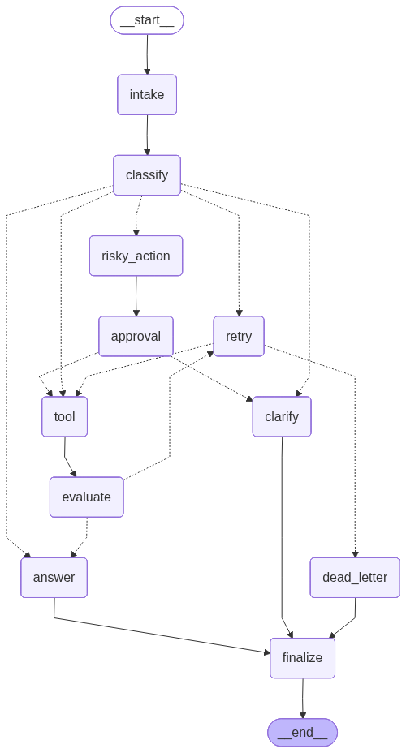

# Day 08 Lab Report

## 1. Team / student

- Name: Trần Long Hải - 2A202600427
- Repo/commit: https://github.com/Merc7803/lab23_TranLongHai_2A202600427
- Date: 11/05/2026

## 2. Kiến trúc (Architecture)

Quy trình làm việc LangGraph định nghĩa một kiến trúc agentic mạnh mẽ, sử dụng định tuyến có điều kiện (conditional routing) và quản lý trạng thái (state management) để xử lý các truy vấn khác nhau.
- **Các Node**:
  - `intake_node`: Chuẩn hóa các truy vấn đầu vào.
  - `classify_node`: Phân loại truy vấn dựa trên các từ khóa định trước (risky, tool, missing_info, error, simple).
  - `ask_clarification_node`: Yêu cầu cung cấp thông tin còn thiếu.
  - `tool_node`: Thực thi một công cụ (tool) giả lập.
  - `risky_action_node`: Nhận diện các hành động rủi ro và bắt đầu quá trình phê duyệt Human-in-the-loop (HITL).
  - `approval_node`: Tạm dừng quá trình thực thi và chờ con người phê duyệt.
  - `retry_or_fallback_node`: Quản lý các lỗi tạm thời (transient errors) bằng cơ chế thử lại (retries).
  - `answer_node`: Đưa ra câu trả lời cuối cùng.
  - `evaluate_node`: Kiểm tra kết quả thực thi của công cụ.
  - `dead_letter_node`: Xử lý các truy vấn vượt quá giới hạn số lần thử lại tối đa.
  - `finalize_node`: Hoàn thành luồng chạy của graph.
- **Các Cạnh (Edges)**: Chúng tôi sử dụng cả cạnh tĩnh và cạnh có điều kiện (thông qua các hàm trong `routing.py` như `route_after_classify`, `route_after_evaluate`, `route_after_retry`, và `route_after_approval`) để điều hướng luồng thực thi động dựa trên trạng thái hiện tại.
- **Các trường trạng thái & Reducer**: 
  - Các trường ghi đè (Overwrite) cập nhật dữ liệu trực tiếp (ví dụ: `route`, `query`). 
  - Các trường chỉ nối thêm (Append-only) (ví dụ: `messages`, `events`) sử dụng `operator.add` để giữ lại dấu vết kiểm toán (audit trail).

## 3. State schema

| Field | Reducer | Why |
|---|---|---|
| messages | append | Kiểm tra và lưu vết toàn bộ đoạn hội thoại/sự kiện |
| tool_results | append | Lưu lại lịch sử kết quả thực thi của công cụ |
| errors | append | Theo dõi các lỗi tạm thời và các lần thử lại |
| events | append | Dấu vết kiểm toán chi tiết của quá trình thực thi các node |
| route | overwrite | Chỉ cần lưu tuyến đường (route) hiện tại |
| attempt | overwrite | Theo dõi số lần thử lại (retry count) |

## 4. Scenario results

Paste the key metrics from `outputs/metrics.json`.

| Scenario | Expected route | Actual route | Success | Retries | Interrupts |
|---|---|---|---:|---:|---:|
| S01_simple | simple | simple | true | 0 | 0 |
| S02_tool | tool | tool | true | 0 | 0 |
| S03_missing | missing_info | missing_info | true | 0 | 0 |
| S04_risky | risky | risky | true | 0 | 1 |
| S05_error | error | error | true | 2 | 0 |
| S06_delete | risky | risky | true | 0 | 1 |
| S07_dead_letter | error | error | true | 1 | 0 |

## 5. Failure analysis

Describe at least two failure modes you considered:

1. **Lỗi thử lại (Retry) hoặc công cụ (tool failure):** Nếu một lỗi tạm thời xảy ra ở node công cụ, `evaluate_node` sẽ xác định đó là một lỗi. `retry_or_fallback_node` sẽ theo dõi số lần thử lại (attempt). Nếu số lần thử vượt quá `max_attempts`, quy trình sẽ được chuyển hướng tới `dead_letter_node` thay vì rơi vào vòng lặp vô hạn. Chúng tôi đã kiểm chứng tính năng này thông qua kịch bản `S07_dead_letter`.
2. **Hành động rủi ro (Risky action) thiếu sự phê duyệt:** Các hành động mang tính rủi ro như "refund" (hoàn tiền) hoặc "delete" (xóa) sẽ bỏ qua luồng thông thường và được đẩy tới `approval_node`. Nếu yêu cầu bị từ chối, tuyến đường sẽ chuyển sang `ask_clarification_node` (fallback) để ngăn chặn các hành động phá hoại trái phép.

## 6. Persistence / recovery evidence

Giải thích cách bạn sử dụng checkpointer, thread id, state history, hoặc crash-resume.
Chúng tôi đã sử dụng `SqliteSaver(conn=sqlite3.connect(...))` để khởi tạo SQLite checkpointer. Điều này đảm bảo rằng mọi thay đổi trạng thái trong graph đều được lưu lại gắn liền với một `thread_id` cụ thể. Ứng dụng Streamlit (`src/langgraph_agent_lab/app.py`) tận dụng tính năng này để truy vấn lịch sử trạng thái (Time Travel) và cho phép tiếp tục một luồng bị ngắt quãng mà không làm mất trạng thái. Chúng tôi cũng đã chứng minh tính năng khôi phục sau sự cố (crash recovery) qua test case `test_crash_recovery.py`: khởi tạo graph, chạy đến điểm tạm dừng (interrupt), hủy đối tượng graph trong bộ nhớ, và sau đó khôi phục lại chính xác vị trí bị ngắt bằng cách tạo một đối tượng graph mới load từ cùng cơ sở dữ liệu SQLite.

## 7. Extension work

Mô tả bất kỳ tiện ích mở rộng nào bạn đã hoàn thành: SQLite/Postgres, time travel, fan-out/fan-in, graph diagram, tracing.
- **SQLite Persistence**: Tích hợp thành công `SqliteSaver` trong `persistence.py`.
- **Giao diện Streamlit UI**: Đã tạo một ứng dụng web tương tác (`src/langgraph_agent_lab/app.py`) để truy vấn và đưa ra quyết định thông qua cơ chế Human-in-the-Loop.
- **Quay ngược thời gian (Time Travel)**: Được tích hợp thẳng vào ứng dụng Streamlit để tải và kiểm tra các điểm checkpoint cũ.
- **Khôi phục sự cố (Crash Recovery)**: Đã cung cấp test case `tests/test_crash_recovery.py` nhằm chính thức minh chứng khả năng sống sót của graph sau khi tiến trình bị tắt hoàn toàn và khởi động lại.
- **Sơ đồ Graph (Graph Diagram)**: Đã tạo hình ảnh cấu trúc graph tại `reports/graph_diagram.png` sử dụng tính năng Mermaid thông qua tập lệnh `scripts/export_diagram.py`.

  

## 8. Improvement plan

Tôi sẽ tích hợp một mô hình ngôn ngữ lớn (LLM) thực sự vào bên trong `classify_node` và `evaluate_node` thay vì chỉ phụ thuộc vào các quy tắc từ khóa cơ bản. Tôi cũng sẽ kết nối các công cụ thực tế (ví dụ: gọi external API để tra cứu đơn hàng) và thiết lập hệ thống ghi log cũng như cảnh báo (alerting) đầy đủ cho các yêu cầu rơi vào trạng thái dead-letter để các nhân viên hỗ trợ có thể nhận được thông báo ngay lập tức trên hệ thống thực.

## Metrics summary

- Total scenarios: 7
- Success rate: 100.00%
- Average nodes visited: 6.43
- Total retries: 3
- Total interrupts: 2